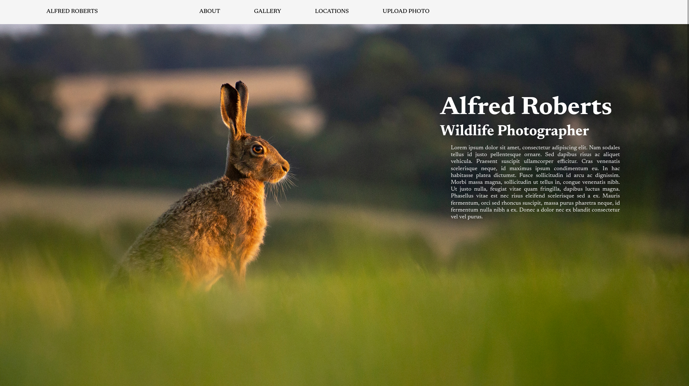
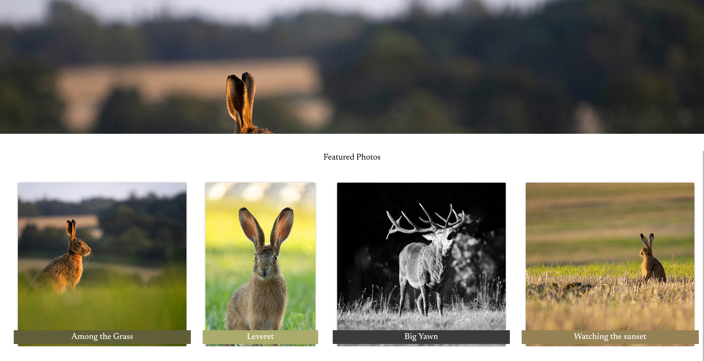
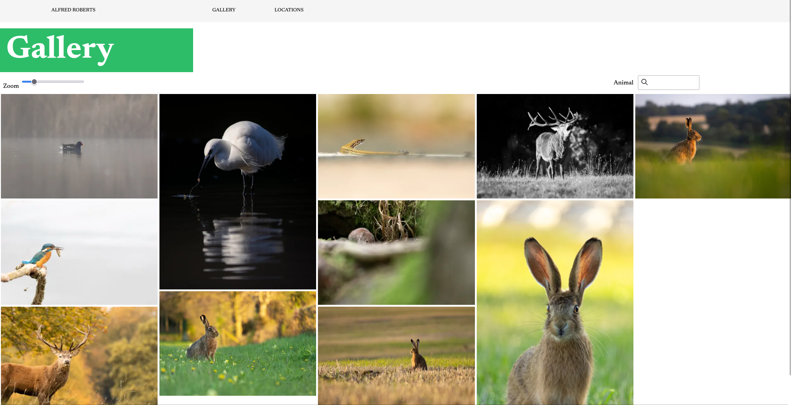
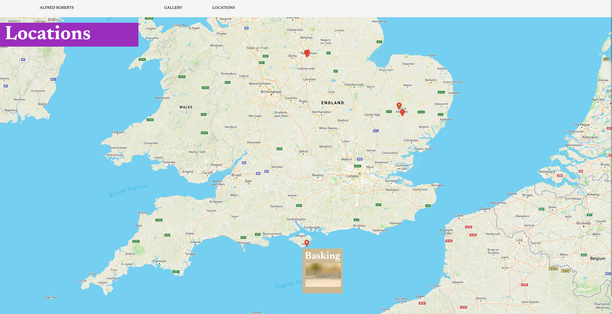

# [Wildlife photography website](https://alfredroberts.netlify.app/)

ReactJS personal photography website, built with photos hosted on Cloudinary and
database with MongoDB. Hosted with Netlify.

## Screenshots

### `npm start`

Runs the app in the development mode.\
Open [http://localhost:3000](http://localhost:3000) to view it in the browser.

The page will reload if you make edits.\
You will also see any lint errors in the console.

### Start backend: `node server/index.js`

### Build static: `npm run build`

Builds the app for production to the `build` folder.\
It correctly bundles React in production mode and optimizes the build for the best performance.

The build is minified and the filenames include the hashes.\
Your app is ready to be deployed!

See the section about [deployment](https://facebook.github.io/create-react-app/docs/deployment) for more information.